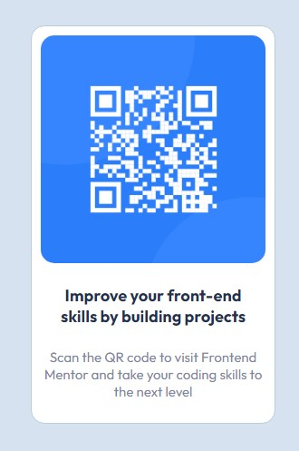

# Frontend Mentor - QR code component solution

This is a solution to the [QR code component challenge on Frontend Mentor](https://www.frontendmentor.io/challenges/qr-code-component-iux_sIO_H). Frontend Mentor challenges help you improve your coding skills by building realistic projects.

## Table of contents

- [Overview](#overview)
  - [Screenshot](#screenshot)
  - [Links](#links)
- [My process](#my-process)
  - [Built with](#built-with)
  - [What I learned](#what-i-learned)
  - [Continued development](#continued-development)
  - [Useful resources](#useful-resources)
- [Author](#author)
- [Acknowledgments](#acknowledgments)

**Note: Delete this note and update the table of contents based on what sections you keep.**

## Overview

### Screenshot



### Links

- Solution URL: [Github](https://github.com/suftdev/QR-Code-Card-Component)
- Live Site URL: [Netlify](https://idyllic-pixie-40caa9.netlify.app/)

## My process

### Built with

- Semantic HTML5 markup
- CSS custom properties

### What I learned

I learned a lot about the basic concepts of the CSS styles, styles like "max-width, margin, object-fit" and many others.
Also importantly, making sure the mobile screen works even at deployment.

```html
<p class="mobile">
  Scan the QR code to visit Frontend Mentor and take your coding skills to the
  next level
</p>
```

```css
#container {
  max-width: 270px;
  margin: 80 auto;
}
```

### Continued development

Going forward, I want to do more challenge, to cement my css understanding and get to work with javascript dom methods next.

### Useful resources

- [Mobile Responsive Design](https://developer.mozilla.org/en-US/docs/Learn/CSS/CSS_layout/Responsive_Design) - This helped me for responsive design. I really liked this article and will give a complete read in the future.

## Author

- Frontend Mentor - [@suftdev](https://www.frontendmentor.io/profile/suftdev)
- Twitter - [@gsuftz](https://www.twitter.com/gsuftz)
